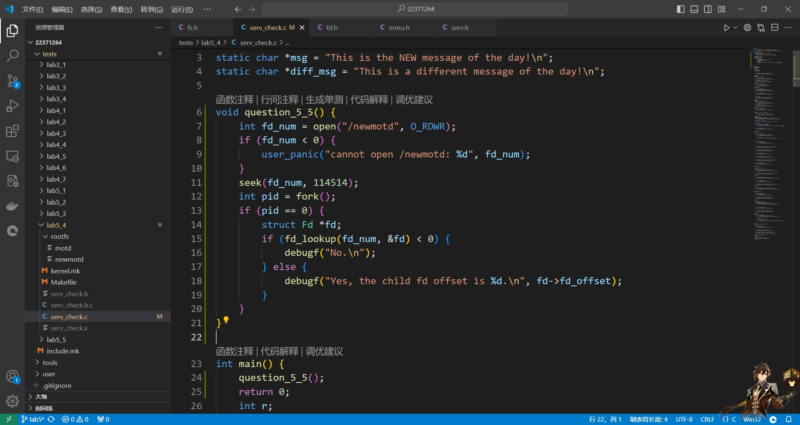
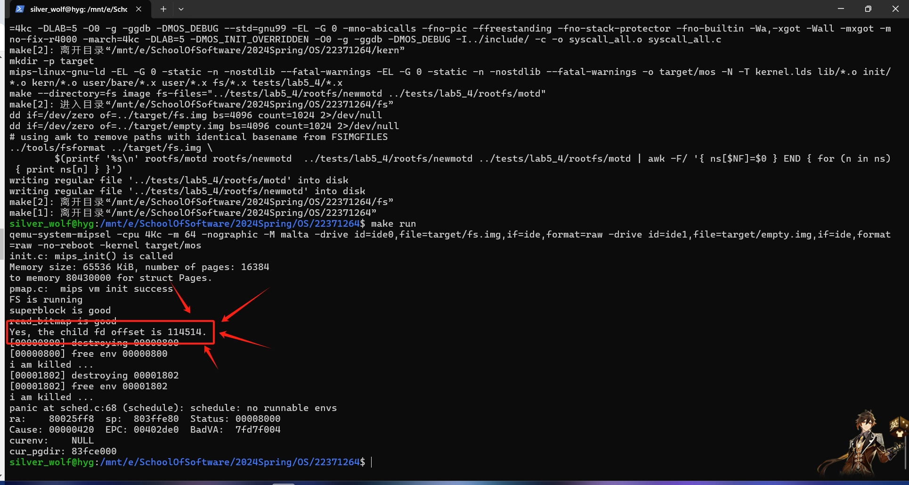

# Lab5实验报告

## 1. 思考题

### 1.1 Thinking 5.1

**如果通过 `kseg0` 读写设备，那么对于设备的写入会缓存到Cache中。这是一种错误的行为，在实际编写代码的时候这么做会引发不可预知的问题。请思考：这么做这会引发什么问题？对于不同种类的设备（如我们提到的串口设备和IDE磁盘）的操作会有差异吗？可以从缓存的性质和缓存更新的策略来考虑。**

对于写入操作，在采用Write-Back刷新策略时，写入数据只有在Cache被换出时才会进行写回，导致后面的操作覆盖了前面的操作，只进行最后一次操作；对于串口设备，只有Cache刷新后才能看到输出，且只能看到最后一个字符；类似的，对于IDE磁盘可能只会写入最后一个扇区。

对于读取操作，任何一种策略都可能会读取到过时的数据，因此产生错误。

### 1.2 Thinking 5.2

**查找代码中的相关定义，试回答一个磁盘块中最多能存储多少个文件控制块？一个目录下最多能有多少个文件？我们的文件系统支持的单个文件最大为多大？**

在 `user/lib/fs.h` 中有如下定义：

```c
// Bytes per file system block - same as page size
#define BLOCK_SIZE PAGE_SIZE
#define BLOCK_SIZE_BIT (BLOCK_SIZE * 8)

// Maximum size of a filename (a single path component), including null
#define MAXNAMELEN 128

// Maximum size of a complete pathname, including null
#define MAXPATHLEN 1024

// Number of (direct) block pointers in a File descriptor
#define NDIRECT 10
#define NINDIRECT (BLOCK_SIZE / 4)

#define MAXFILESIZE (NINDIRECT * BLOCK_SIZE)

#define FILE_STRUCT_SIZE 256

struct File {
	char f_name[MAXNAMELEN]; // filename
	uint32_t f_size;	 // file size in bytes
	uint32_t f_type;	 // file type
	uint32_t f_direct[NDIRECT];
	uint32_t f_indirect;

	struct File *f_dir; // the pointer to the dir where this file is in, valid only in memory.
	char f_pad[FILE_STRUCT_SIZE - MAXNAMELEN - (3 + NDIRECT) * 4 - sizeof(void *)];
} __attribute__((aligned(4), packed));
```

在 `include/mmu.h` 中有如下定义：

```c
#define PAGE_SIZE 4096
```

所以一个磁盘块最多能存储的文件控制块数量为 $\frac{BLOCK\_SIZE}{FILE\_STRUCT\_SIZE}=\frac{4096}{256}=16$ 。

一个目录，也就是一个 `File` 结构体最多指向 `1024` 个磁盘块，一个磁盘块中最多有 `16` 个文件控制块，一个目录下最多有 $1024\times16=16384$ 个文件。

同样的，一个 `File` 结构体最多指向 `1024` 个磁盘块，一个磁盘块的大小为 `4096` 字节，所以单个文件最大为 $1024\times4096=2^{22}B=4MB$ 。

### 1.3 Thinking 5.3

**请思考，在满足磁盘块缓存的设计的前提下，我们实验使用的内核支持的最大磁盘大小是多少？**

在 `fs/serv.h` 中有如下代码：

```c
/* Maximum disk size we can handle (1GB) */
#define DISKMAX 0x40000000
```

所以我们能支持的最大磁盘大小为 $1GB$ 。

### 1.4 Thinking 5.4

**在本实验中 `fs/serv.h` 和 `user/include/fs.h` 等文件中出现了许多宏定义，试列举你认为较为重要的宏定义，同时进行解释，并描述其主要应用之处。**

首先是 `fs/serv.h` 文件：

```c
#define PTE_DIRTY 0x0004 // 文件系统块缓存被修改

#define SECT_SIZE 512 // 每磁盘块扇区字节数
#define SECT2BLK (BLOCK_SIZE / SECT_SIZE) // 扇区对应磁盘块

#define DISKMAP 0x10000000 // 块缓存映射起始地址

#define DISKMAX 0x40000000 // 能够支持的最大磁盘容量
```

然后是 `user/include/fs.h` 文件：

```c
// 每个文件系统块的大小——和页面大小相同
#define BLOCK_SIZE PAGE_SIZE
#define BLOCK_SIZE_BIT (BLOCK_SIZE * 8)

// 文件名的最大长度
#define MAXNAMELEN 128

// 路径的最大长度
#define MAXPATHLEN 1024

// 文件控制块中直接块指针个数
#define NDIRECT 10
// 文件控制块中非直接块指针个数
#define NINDIRECT (BLOCK_SIZE / 4)

// 最大文件大小
#define MAXFILESIZE (NINDIRECT * BLOCK_SIZE)

// 文件控制块结构体大小
#define FILE_STRUCT_SIZE 256

// 文件转磁盘块
#define FILE2BLK (BLOCK_SIZE / sizeof(struct File))

// 文件类型
#define FTYPE_REG 0 // 普通文件
#define FTYPE_DIR 1 // 目录文件

// 文件系统超级块

#define FS_MAGIC 0x68286097 // 魔数
```

### 1.5 Thinking 5.5

**在Lab4“系统调用与 `fork` ”的实验中我们实现了极为重要的 `fork` 函数。那么 `fork` 前后的父子进程是否会共享文件描述符和定位指针呢？请在完成上述练习的基础上编写一个程序进行验证。**

编写如下的测试代码：



运行结果如下：



说明 `fork` 前后的父子进程会共享文件描述符和定位指针。

### 1.6 Thinking 5.6

**请解释 `File` `Fd` `Filefd` 结构体及其各个域的作用。比如各个结构体会在哪些过程中被使用，是否对应磁盘上的物理实体还是单纯的内存数据等。说明形式自定，要求简洁明了，可大致勾勒出文件系统数据结构与物理实体的对应关系与设计框架。**

```c
struct File {
	char f_name[MAXNAMELEN]; // 文件名
	uint32_t f_size;	 // 文件以字节为单位的大小
	uint32_t f_type;	 // 文件类型
	uint32_t f_direct[NDIRECT]; // 直接磁盘块指针
	uint32_t f_indirect; // 间接磁盘块指针

	struct File *f_dir; // 指向文件所在目录且仅在内存中有效
	char f_pad[FILE_STRUCT_SIZE - MAXNAMELEN - (3 + NDIRECT) * 4 - sizeof(void *)]; // 用于内存对齐
} __attribute__((aligned(4), packed));

// file descriptor
struct Fd {
	u_int fd_dev_id; // 外设 id 即外设类型
	u_int fd_offset; // 读写偏移量
	u_int fd_omode; // 文件打开方式
};

// file descriptor + file
struct Filefd {
	struct Fd f_fd; // 文件描述符
	u_int f_fileid; // 文件自身 id
	struct File f_file; // 文件本身
};
```

### 1.7 Thinking 5.7

**图中有多种不同形式的箭头，请解释这些不同箭头的差别，并思考我们的操作系统是如何实现对应类型的进程间通信的。**


我们的进程通过和 `file_server` 这个进程的通信来操作文件。

在用户进程中，通过 `user/file.c` 中的函数操作文件系统，在这些用户接口函数中，调用了 `user/fsipc.c` 中的函数，从而通过 `user/fsipc.c` 中的这些函数与文件系统进行了通信。在文件系统进程中，初始化完成后将运行 `serve` 函数，在这个函数中，调用了 `ipc_recv` ，通过返回值的不同，在 `switch...case` 语句块中跳转到不同的函数，从而完成通信。

## 2. 难点分析

本次实验代码量巨大，为理解其逻辑关系以及编写练习带来了巨大的困难。

这部分代码主要分为三部分：

* 外设控制：设备读写系统调用，IDE磁盘驱动。
* 文件系统：磁盘布局，文件系统数据结构，文件系统服务进程等。
* 文件系统接口：一系列用户库函数。

这其中比较难理解的就是 `tools/fsformat.c` 这个文件，它会对磁盘镜像进行格式化，建立初始的文件系统，同时将宿主机的文件复制到这个磁盘镜像中，以便其他操作的继续进行。可以说，这个格式化程序是整个实验的基础。

在Lab5-2-exam中，需要实现一个递归复制某目录到另一个目录的功能，核心代码如下：

```c
int copy_file_content(struct File *src, struct File *dst) {
	void *src_blk, *dst_blk;
	int r;
	int nblock;
	// Calculate the total number of blocks in the source file.
	nblock = ROUND(src->f_size, BLOCK_SIZE) / BLOCK_SIZE;
	for (u_int i = 0; i < nblock; i++) {
		// Lab 5-2-Exam: Your code here. (3/6)
		// debugf("OK");
		try(file_get_block(src, i, &src_blk));
		try(file_get_block(dst, i, &dst_blk));
		// debugf("OK");
		memcpy(dst_blk, src_blk, BLOCK_SIZE);
		file_dirty(dst, i * BLOCK_SIZE);
	}
	// Flush the changes to the destination file
	file_flush(dst);
	return 0;
}

int copy_directory_contents(struct File *src, struct File *dst) {
	struct File *dir_content;
	void *blk;
	int r;
	// Iterate over each block in the source directory
	for (u_int i = 0; i < ROUND(src->f_size, BLOCK_SIZE) / BLOCK_SIZE; i++) {
		if ((r = file_get_block(src, i, &blk)) < 0) {
			return r;
		}
		dir_content = (struct File *)blk;
		for (int j = 0; j < FILE2BLK; j++) {
			if (dir_content[j].f_name[0] == '\0') continue;
			struct File *dst_file;
			// Step1: Alloc dst_file using 'dir_alloc_file'
			// Lab 5-2-Exam: Your code here. (4/6)
			try(dir_alloc_file(dst, &dst_file));
			// Step2: Assign corresponding values of 'f_name', 'f_dir', 'f_size', 'f_type' to dst_file
			strcpy(dst_file->f_name, dir_content[j].f_name);
			dst_file->f_dir = dst;
			dst_file->f_size = dir_content[j].f_size;
			dst_file->f_type = dir_content[j].f_type;

			// Step3: Invoke either 'copy_directory_contents' or 'copy_file_content',
			// depending on the value of 'f_type'.
			// Lab 5-2-Exam: Your code here. (5/6)
			if (dst_file->f_type == FTYPE_DIR) {
				try(copy_directory_contents(&dir_content[j], dst_file));
			} else if (dst_file->f_type == FTYPE_REG) {
				try(copy_file_content(&dir_content[j], dst_file));
			}
		}
	}
	file_flush(dst);
	return 0;
}

int directory_copy(char *src_path, char *dst_path) {
	struct File *src_dir, *dst_dir;
	int r;
	if ((r = file_open(src_path, &src_dir)) < 0) {
		return r;
	}
	if ((r = file_create(dst_path, &dst_dir)) < 0) {
		return r;
	}
	dst_dir->f_type = FTYPE_DIR;
	return copy_directory_contents(src_dir, dst_dir);
}
```

在Lab5-2-extra中，需要为文件添加权限控制，并在需要的时候检测是否具有操作权限。同时，还需要实现修改文件权限的服务函数。由于本人这部分实验没有通过，且需要添加代码的位置分散且众多，这里就不再展示代码。

总的来说，这次实验难度很大，需要对整体框架和调用关系有清晰的认识。

## 3. 实验体会

本学期操作系统的上机实验到这里就要告一段落了，虽然说最后有一点小遗憾，但是整体结果还是不错的，就这样吧。


